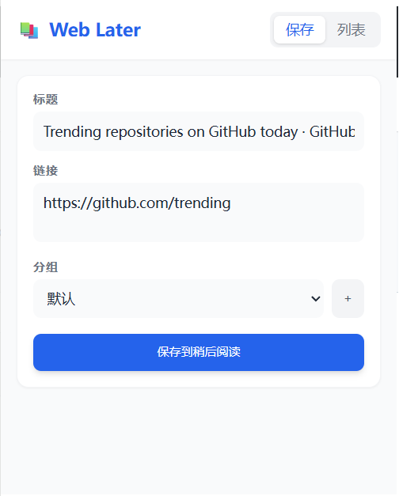

# Web Later

一个轻量级的浏览器插件，帮助用户便捷地保存网页链接以便稍后阅读。


## 功能特性

### 核心功能
- **自动获取页面信息** - 打开插件时自动获取当前标签页的标题和 URL
- **链接保存** - 一键保存网页到稍后阅读列表
- **分组管理** - 支持创建自定义分组，便于分类管理
- **链接列表** - 清晰展示所有已保存的链接
- **快捷操作** - 点击链接在新标签页打开，支持删除操作

### 界面特点
- 简洁现代的 UI 设计
- 响应式布局
- 支持按分组筛选
- TailwindCSS 样式



## 技术栈

- **包管理器**: [pnpm](https://pnpm.io/)
- **框架**: [Vue 3](https://vuejs.org/) (Composition API + `<script setup>`)
- **构建工具**: [Vite](https://vitejs.dev/) + [CRXJS](https://crxjs.dev/)
- **插件标准**: Chrome Extension Manifest V3
- **样式**: [TailwindCSS](https://tailwindcss.com/)
- **类型**: [TypeScript](https://www.typescriptlang.org/)
- **日期处理**: [date-fns](https://date-fns.org/)

## 安装和开发

### 环境要求
- Node.js >= 18
- pnpm >= 8

### 安装依赖
```bash
pnpm install
```

### 开发模式
```bash
pnpm dev
```

### 构建插件
```bash
pnpm build
```

构建产物位于 `dist` 目录，可直接加载到浏览器。

## 加载到浏览器

### Chrome / Edge
1. 打开 `chrome://extensions/`
2. 开启"开发者模式"
3. 点击"加载已解压的扩展程序"
4. 选择项目的 `dist` 目录

### Firefox
1. 打开 `about:debugging`
2. 点击"此 Firefox"
3. 点击"临时载入附加组件"
4. 选择项目的 `dist` 目录

## 项目结构

```
web_later/
├── dist/                    # 构建输出目录
├── doc/                     # 文档
│   └── plugin_design.md
├── src/
│   ├── background/          # 后台脚本 (Service Worker)
│   │   └── index.ts
│   ├── popup/              # 插件弹窗
│   │   ├── components/     # Vue 组件
│   │   │   ├── AppHeader.vue
│   │   │   ├── BookmarkItem.vue
│   │   │   ├── BookmarkList.vue
│   │   │   ├── CreateGroupInput.vue
│   │   │   ├── GroupFilter.vue
│   │   │   └── SaveForm.vue
│   │   ├── composables/    # Vue Composables
│   │   │   ├── useBookmarks.ts
│   │   │   ├── useGroups.ts
│   │   │   └── useCurrentTab.ts
│   │   ├── App.vue
│   │   ├── index.html
│   │   └── main.ts
│   ├── utils/             # 工具函数
│   │   └── storage.ts
│   ├── manifest.ts        # 插件配置
│   ├── types.ts          # TypeScript 类型定义
│   └── style.css
├── CHANGELOG.md
├── package.json
├── pnpm-lock.yaml
├── vite.config.ts
├── tsconfig.json
└── tailwind.config.js
```

## 数据结构

插件使用 `chrome.storage.local` 持久化数据：

```typescript
interface Bookmark {
  id: string;          // 唯一标识符
  title: string;       // 网页标题
  url: string;         // 网页链接
  groupId: string;     // 所属分组ID
  createdAt: number;  // 创建时间戳
}

interface Group {
  id: string;          // 唯一标识符
  name: string;        // 分组名称
  order: number;       // 排序权重
}

interface StorageSchema {
  bookmarks: Bookmark[];
  groups: Group[];
}
```

## 开发指南

### 添加新功能

1. **添加新组件** - 在 `src/popup/components/` 创建 Vue 组件
2. **创建 Composable** - 在 `src/popup/composables/` 添加逻辑复用
3. **更新类型** - 在 `src/types.ts` 添加相关类型定义
4. **测试构建** - 运行 `pnpm build` 确保类型正确

### 代码规范

- 使用 TypeScript 进行类型检查
- 遵循 Vue 3 Composition API 最佳实践
- 组件使用 `<script setup>` 语法
- 添加 JSDoc 注释说明模块功能

### 打包发布

#### 打包成 ZIP（推荐用于 Chrome Web Store）
```bash
pnpm run build
# 将 dist 目录打包为 zip 文件
```

#### 打包成 CRX（用于离线分发）
需要使用私钥签名 CRX 文件，参考 Chrome 扩展打包文档。

## 更新日志

查看 [CHANGELOG.md](./CHANGELOG.md) 了解版本更新详情。

## 许可证

[GNU General Public License v3](./LICENSE)

## 贡献

欢迎提交 Issue 和 Pull Request！

## 联系方式

如有问题或建议，请在项目中提交 Issue。
